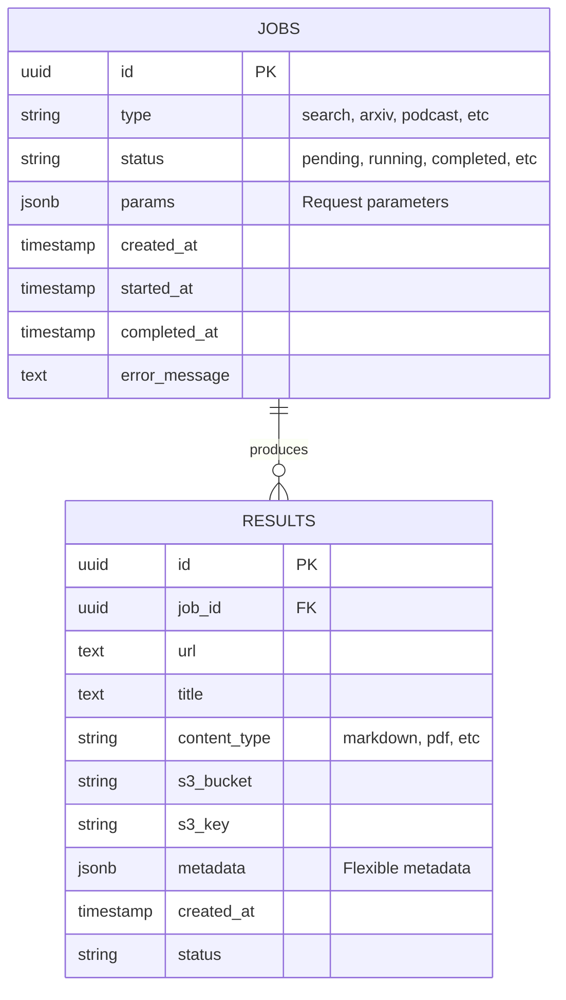

# PostgreSQL Schema Design for Crawler Platform

This document outlines the proposed database schema for the Lab Crawler Platform. It is designed to support various types of crawler tasks (Search, Arxiv, Podcast, Agent, etc.) and store their results in a structured format while linking to the raw files stored in RustFS (S3).

## 1. Overview

The schema centers around two main entities:

1. **Jobs**: Represents an asynchronous task requested by the user or system (e.g., "Search for 'AI Agents'").
2. **Results**: Represents the individual items found/crawled by a job (e.g., a specific webpage, PDF, or podcast episode).

## 2. Entity-Relationship Diagram (ERD)



## 3. Table Definitions (SQL)

### 3.1. Jobs Table

Stores the state and parameters of every crawler task.

```sql
CREATE EXTENSION IF NOT EXISTS "uuid-ossp";

CREATE TABLE jobs (
    id UUID PRIMARY KEY DEFAULT uuid_generate_v4(),
    type VARCHAR(50) NOT NULL, -- e.g., 'search', 'arxiv', 'podcast', 'exploration', 'agent', 'batch'
    status VARCHAR(20) NOT NULL DEFAULT 'pending', -- 'pending', 'running', 'completed', 'failed', 'cancelled'
    params JSONB NOT NULL DEFAULT '{}'::jsonb, -- Stores request args like keywords, limit, url, model
    created_at TIMESTAMP WITH TIME ZONE DEFAULT NOW(),
    started_at TIMESTAMP WITH TIME ZONE,
    completed_at TIMESTAMP WITH TIME ZONE,
    error_message TEXT,
    priority INTEGER DEFAULT 0
);

-- Index for faster querying of recent or active jobs
CREATE INDEX idx_jobs_status ON jobs(status);
CREATE INDEX idx_jobs_created_at ON jobs(created_at DESC);
CREATE INDEX idx_jobs_type ON jobs(type);
```

### 3.2. Results Table

Stores the output of jobs. Since different jobs produce different types of data (PDFs vs MP3s vs Markdown), specific attributes are stored in `metadata` JSONB, while common attributes (URL, S3 path) have their own columns.

```sql
CREATE TABLE results (
    id UUID PRIMARY KEY DEFAULT uuid_generate_v4(),
    job_id UUID NOT NULL REFERENCES jobs(id) ON DELETE CASCADE,
    url TEXT, -- The source URL of the result
    title TEXT,
    content_type VARCHAR(50), -- 'text/markdown', 'application/pdf', 'audio/mpeg', 'application/json'
    
    -- Storage Location (RustFS/S3)
    s3_bucket VARCHAR(64),
    s3_key TEXT,
    
    -- Flexible Metadata (Authors, Published Date, Audio Duration, Agent Thoughts, etc.)
    metadata JSONB DEFAULT '{}'::jsonb,
    
    status VARCHAR(20) DEFAULT 'success', -- 'success', 'failed'
    error_message TEXT,
    created_at TIMESTAMP WITH TIME ZONE DEFAULT NOW()
);

-- Index for finding results of a specific job
CREATE INDEX idx_results_job_id ON results(job_id);
-- Index for checking if a URL has already been processed (optional deduplication)
CREATE INDEX idx_results_url ON results(url);
```

### 3.3. System Metrics (Optional)

To replace or augment the in-memory `metrics_state`.

```sql
CREATE TABLE system_metrics (
    id SERIAL PRIMARY KEY,
    timestamp TIMESTAMP WITH TIME ZONE DEFAULT NOW(),
    active_workers INTEGER DEFAULT 0,
    queue_size INTEGER DEFAULT 0,
    avg_latency DOUBLE PRECISION
);
```

## 4. JSONB Structure Examples

### 4.1. Jobs `params`

**Type: 'arxiv'**

```json
{
  "keywords": "federated learning",
  "year": "2023",
  "limit": 5,
  "output_dir": "/tmp/arxiv"
}
```

**Type: 'agent'**

```json
{
  "url": "https://example.com",
  "prompt": "Summarize the key points",
  "model": "gpt-4o",
  "api_key": "sk-..."
}
```

### 4.2. Results `metadata`

**Type: 'podcast' (Result from Podcast Job)**

```json
{
  "published_date": "2023-10-27T10:00:00Z",
  "duration_seconds": 3600,
  "podcast_collection": "Tech Talk"
}
```

**Type: 'arxiv' (Result from Arxiv Job)**

```json
{
  "authors": ["Alice Smith", "Bob Jones"],
  "pdf_url": "http://arxiv.org/pdf/1234.5678",
  "version": "v1"
}
```

## 5. Implementation Strategy

1. **Migration Tool**: Use **Alembic** (standard for Python/SQLAlchemy) to manage these schema changes.
2. **ORM**: Use **SQLAlchemy (AsyncIO)** or **Tortoise ORM** in FastAPI to interact with these tables.
3. **Integration**:
    * When a request comes into `/api/*`, create a `Job` record with status `pending`.
    * Update `Job` status to `running` when processing starts.
    * Instead of just appending to a list, insert rows into `Results` as they are fetched.
    * Update `Job` to `completed` when done.
